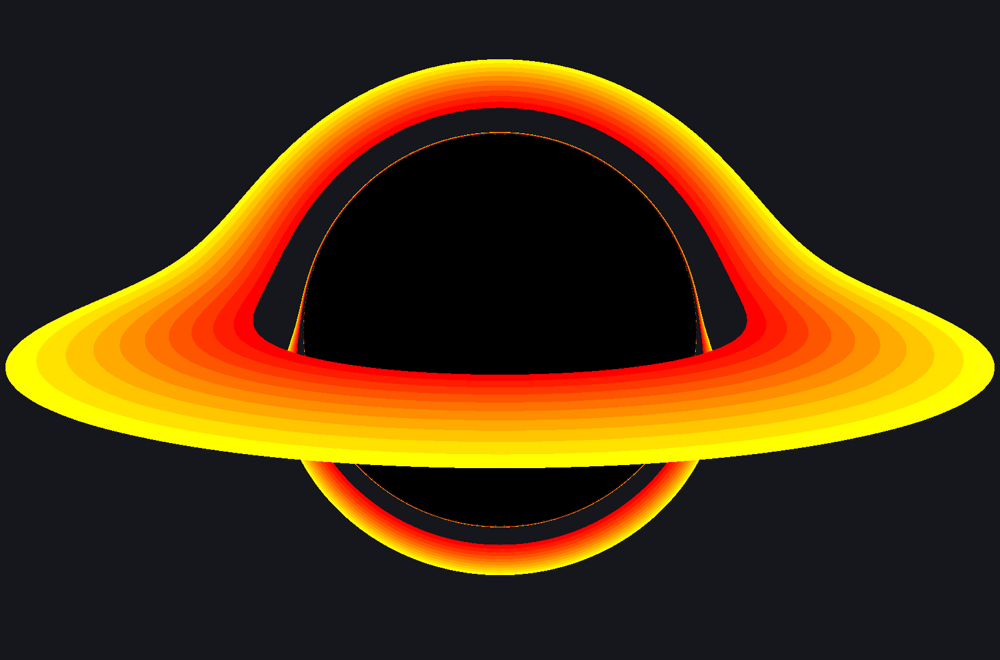

# Hi, I'm Martin Sundal Aspås 👋

## About Me

Senior Engineer at [Aker Solutions](https://www.akersolutions.com/) in Verdal, Norway — promoted at 19 after joining the Technology Department as a developer at 17.

I'm currently pursuing a degree in **Applied Physics and Mathematics** at **NTNU**, combining academic studies with hands-on engineering in a highly innovative industrial environment.

## What I Work On

- **Automated Welding Planning** — Lead developer on the world's first fully automated welding planner for the new Verdal Production Line
- **Industrial Robotics** — Contributing to projects in robotic welding and 3D printing
- **Teaching** — Holding introductory robotics courses for apprentices at Aker Solutions

## Latest projects

### [Cipherbound](https://cipherbound.com)

A Pokémon-like game built entirely from scratch in C++. [Cipherbound](https://cipherbound.com) is my latest project and a showcase of game systems, world-building, and full-stack product development.

### [Interactive Black Hole Renderer](https://github.com/MartinSA04/Black-Hole-Simulator)

 

A physically-based black hole renderer written wholly from scratch in C++. Simulates gravitational lensing by tracing light rays through curved spacetime around a Schwarzschild black hole.

## Languages & Tools

## Connect

