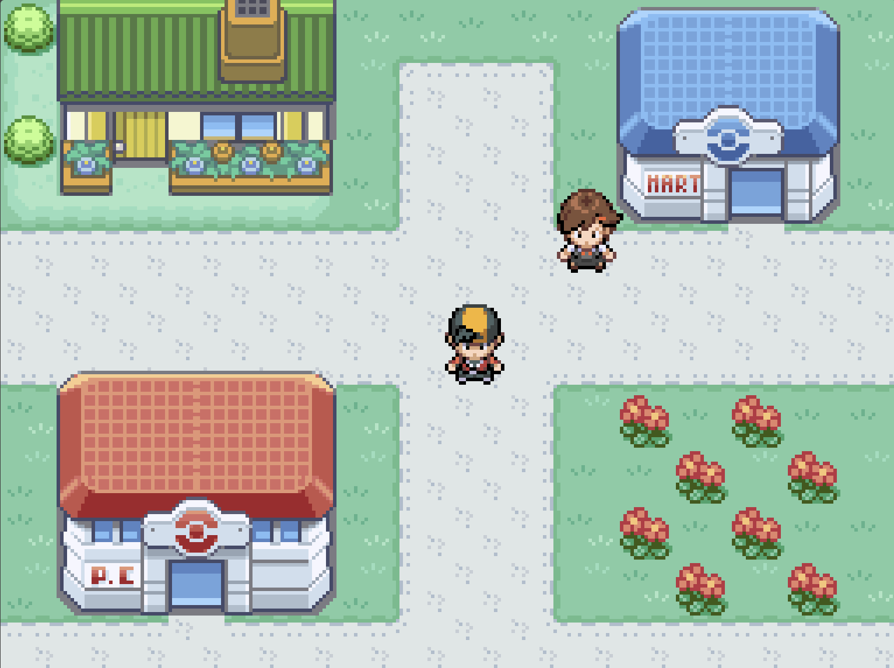

# Hi, I'm Martin Sundal Aspås 👋

## About Me

Senior Engineer at [Aker Solutions](https://www.akersolutions.com/) in Verdal, Norway. I joined the Technology Department as a developer at 17 and was promoted at 19.

By day I'm studying **Applied Physics and Mathematics** at **NTNU**, and by slightly later in the day I'm writing the code that keeps it all running.

## What I Work On

- **Automated Welding Planning** — Lead developer on a fully automated welding planner for the new Verdal Production Line. Allegedly the world's first, which mostly means there's no one to compare homework with.
- **Industrial Robotics** — Teaching big metal arms to weld and 3D print without making modern art out of the workshop.
- **Side projects** — Making smaller projects that let me explore graphics, gameplay, tools, and ideas I find interesting.

## Latest projects

### [Cipherbound](https://cipherbound.com)

 

A Pokémon-ish game built from scratch in C++ — because reinventing a genre from zero sounded like a reasonable weekend plan. Repo lives at [github.com/MartinSA04/CipherBound](https://github.com/MartinSA04/CipherBound). Won **Best Project in TDT4102 at NTNU**.

### [Game of Life Text](https://github.com/MartinSA04/GameOfLifeText)

 

Generates starting states for Conway's Game of Life that converge to whatever text you feed it. So you get to watch a chaotic primordial soup slowly arrange itself into your grocery list, which is exactly the kind of thing I find unreasonably satisfying.

### [Interactive Black Hole Renderer](https://github.com/MartinSA04/Black-Hole-Simulator)

 

A physically-based black hole renderer written wholly from scratch in C++. Simulates gravitational lensing by tracing light rays through curved spacetime around a Schwarzschild black hole.

## Languages & Tools

## Connect

