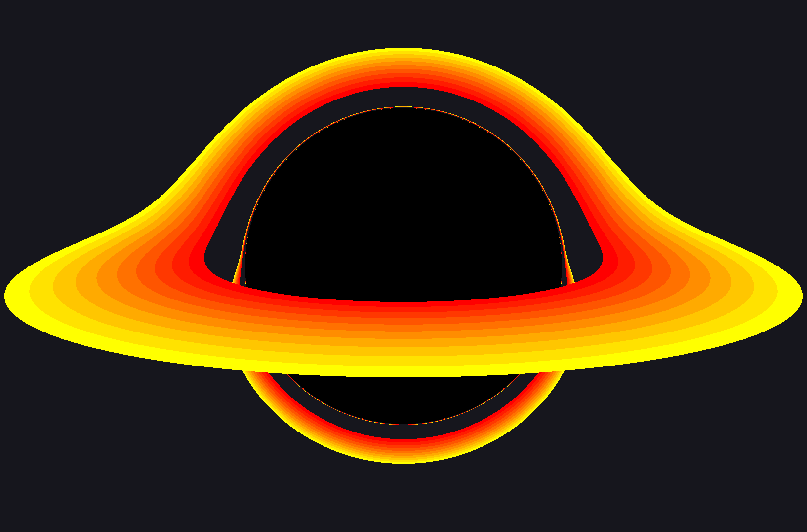

# Hi, I'm Martin Sundal Aspås 👋

> I write software for things that move or compute.

## About Me

I'm a software engineer in Trondheim, Norway. At [Aker Solutions](https://www.akersolutions.com/) I work on industrial software and automation, building tools that make complex systems easier to run.

Alongside that, I study **Applied Physics and Mathematics** at **NTNU**.

## What I Work On

- **Automation & engineering tools.** Lead developer on a fully automated welding planner for the new Verdal Production Line at Aker Solutions, one of the first of its kind.
- **Software for the physical world.** Robotics and simulation code for welding and 3D printing, where geometry and motion drive the design.
- **Data foundation & machine learning.** Building the data infrastructure that industrial systems rely on and applying machine learning to turn it into useful predictions.
- **System architecture.** Designing how services, data, and automation fit together so larger systems stay reliable and maintainable.
- **Side projects.** Smaller things I build to learn or to solve a specific problem: games, graphics experiments, and one-off tools.

## Latest projects

### [NTNU Course Data API & MCP Server](https://github.com/MartinSA04/ntnu-api)

A TypeScript client that puts NTNU's scattered public course data behind one typed interface: catalog search, teaching schedules, weekly timetables, exam logistics, and historical grade statistics. Published on npm as [`ntnu-api`](https://www.npmjs.com/package/ntnu-api) with zero runtime dependencies, so it runs in Node, browsers, and Cloudflare Workers alike.

On top of it sits [`ntnu-mcp`](https://github.com/MartinSA04/ntnu-mcp), a remote MCP server running as a Cloudflare Worker that exposes the data as ten read-only tools for LLM assistants. Add `https://ntnu-mcp.martinsundal.no/mcp` as a custom connector in Claude or ChatGPT and it can search courses, compare them, and catch timetable clashes before you register.

### [Study Companion](https://github.com/MartinSA04/StudyCompanion)

An Astro framework and component library for interactive course study guides. Each course is authored as plain data (a `course.yaml` and a handful of MDX sections) that pins a version of the framework, which owns the design, page wiring, and roughly twenty widgets. It produces static output with server-rendered KaTeX and almost no client-side JavaScript. It powers course sites across physics, quantum mechanics, algorithms, and classical mechanics. Browse them at [kurs.martinsundal.no](https://kurs.martinsundal.no).

### [Cipherbound](https://cipherbound.com)

 

A Pokémon-style game built from scratch in C++. Repo at [github.com/MartinSA04/CipherBound](https://github.com/MartinSA04/CipherBound). Won **Best Project in TDT4102 at NTNU**.

### [Game of Life Text](https://github.com/MartinSA04/GameOfLifeText)

 

Generates starting states for Conway's Game of Life that converge to whatever text you feed it, so a random-looking grid gradually resolves into readable words.

### [Interactive Black Hole Renderer](https://github.com/MartinSA04/Black-Hole-Simulator)

 

A physically based black hole renderer written from scratch in C++. It simulates gravitational lensing by tracing light rays through the curved spacetime around a Schwarzschild black hole.

## Languages & Tools

## Connect

